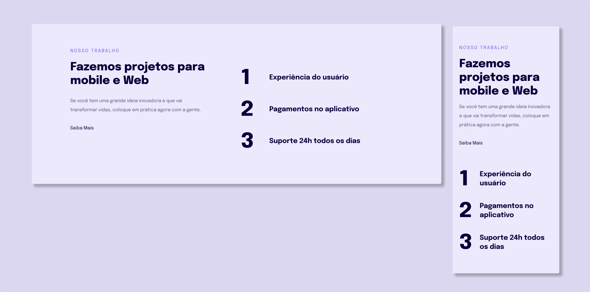

<div align="center">
  
  <h2 align="center">Responsividade</h2>

</div>

<br />


### Demo Screeshots



### About

Project developed during stage 3 - Moving forward in HTML and CSS, in [Rocketseat](https://github.com/Rocketseat) explorer course.  

In this project, essential skills for web developers and designers were learned, allowing websites and applications that adapt to different devices and screen sizes. Involving understanding technical concepts such as media queries and performing testing to ensure a consistent user experience. The benefits are better accessibility, performance, and user engagement, making it a valuable skill in building modern websites and applications.

### Prerequisites

Before you begin, ensure you have met the following requirements:

- [Git](https://git-scm.com/downloads "Download Git") must be installed on your operating system.

### Run Locally

To run **Responsividade** locally, run this command on your git bash:

Linux and macOS:

```bash
sudo git clone https://github.com/denilsonbaptista/responsividade.git
```

Windows:

```bash
git clone https://github.com/denilsonbaptista/responsividade.git
```

### Contact

If you want to contact with me you can reach me at [Linkedin](https://www.linkedin.com/in/denilsonbaptista/).

### License

This project is **free to use** and does not contains any license.